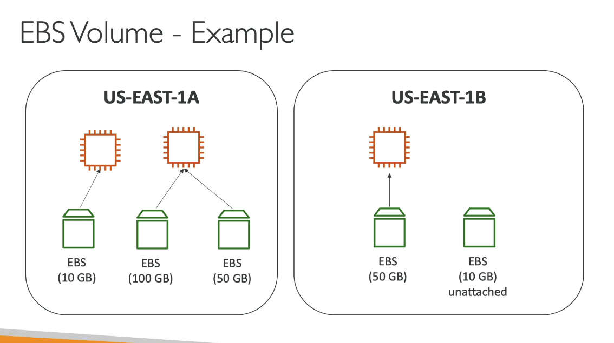
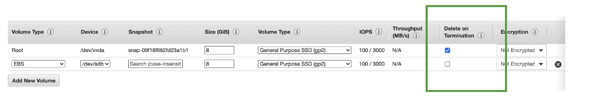
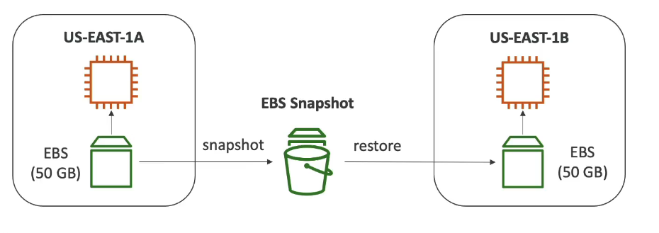
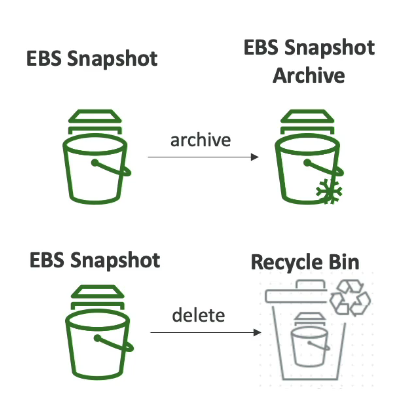
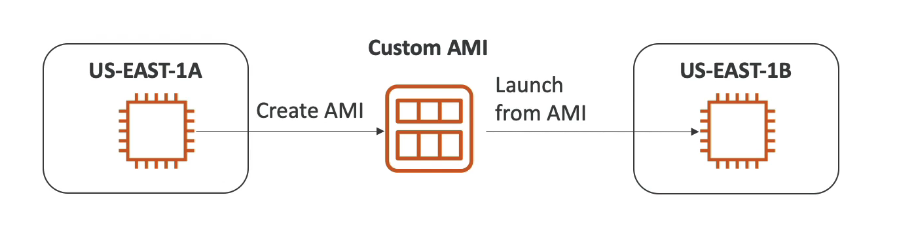
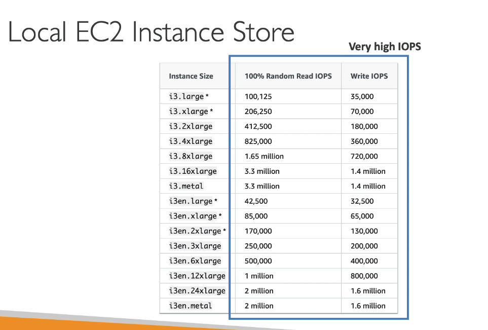
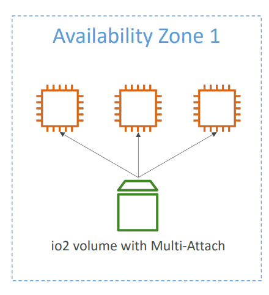

## What's an EBS volume?

- An EBS (Elastic Block Storage) volume is a network drive you can attach to your instance while they run.
- It allows your instances to persist data, even after their termination.
- They can only be mounted to one instance at a time (at the CCP level).
- They are bound to a specific availability zone.
- Analogy: Think of them as "network usb stick"
- Free tier: 30 GB of free EBS storage of type general purpose (SSD) or Margneitc per month.

***Note:*** CCP - Certified cloud practitioner - one EBS can be only mounted to one EC2 instassociate level (Solution Architect, Developer, SysOps): "multi-attach" feature for some EBS.

## EBS Volume

- It's a network drive (i.e. not a physical drive).
    - It uses the network to communicate the instance, which means there might be a bit of latency.

    - It can be detach from an EC2 instance and attached to another one quickly

- It's locked to an availability zone (AZ)
    - An EBS volume in us-east-1a cannot be attached to us-east-1b
    - To move a volume across, you first need to snapshot it.

- Have a provisioned capacity (size in GBS, and IOPS)
    - you get billed for all the provisioned capacity.
    - you can increase the capacity of the drive over time.

## EBS - Delete on Termination attribute

- Controls the EBS behavior when an EC2 instances terminates.
    - By default, the root EBS volume is deleted (attribute enabled)
    - By default, any other attached EBS volume is not deleted (attribute disabled)
- This can be controlled by the AWS console/AWS CLI
- Use case: preserve root volume when instance is terminated.

## EBS Snapshots

- Make a backup (snapshot) of your EBS volume at a point in time.
- Not necessary to detach volume to do snapshot, but recommended.
- Can copy snapshots across AZ or Region

## EBS Snapshots Features

- EBS Snapshot Archieve
    - Move a Snapshot to an archieve tier that is 75% cheaper.
    - Takes within 24 to 72 hours for restoring the archieve.
- Recycle Bin for EBS Snapshots.
    - Setup rules to retain deleted snapshots so you can recover them after an accidental deletion.
    - Specify retetion (from 1 dat to 1 year)
- Fast Snapshot Restore (FSR)
    - Force full initialization of snapshot to have no latency on the first use ($$$)

## AMI Overview

- AMI = Amazon Machine Image
- AMI are customization of an EC2 instance
    - You add your own software, configuration, operating system, monitoring..
    - Faster boot/configuration time because all your software is pre-packaged
- AMI are built for a specific region (and can be copied across regions)
- You can launch EC2 instances from:
    - A public AMI: AWS provided
    - Your own AMI: you make and maintain them yourself
    - An AWS Marketplace AMI: an AMI someone else made (and potentially sells)

## AMI Process (from an EC2 instance)

- start an EC2 instance and customize it
- Stop the instance (fro data integrity)
- Build an AMI - this will also create EBS snapshots
- Launch instances from other AMIs

## EC2 Instacne Store

- EBS volumes are network drives with good but "limited" performance.
- If you need a high-performance hardware disk, use EC2 instance store

- Better I/O performance
- EC2 instance store lose their storage if they're stopped (ephemeral)
- Good for buffer / cache / stratch data / temporary content
- Risk of data loss if hardware fails.
- Backups and Replication are your resposability

## EBS Volume Types

- EBS Volumes comes in 6 types
    - gp2/gp3 (SSD): General purpose SSD volume that balances price and performance for a wide variety of workloads.
    
    - io1 / io2 Block Express (SSD): Highest-performance SSD volume for mission-critial low-latency or high-throughput workloads
    
    - st 1 (HDD): low cost HDD volume design for frequently accessed, throughput    intensive workload

    - sc1 (HDD): lowest cost HDD volume design for less frequently accessed workloads.

- EBS volume are characterized in Size | throughput | IOPS (I/O Ops per sec)
- When in doubt always consult the AWS documentation - it's good!
- Only gp2/gp3 and io1/io2 Block Express can be used as boot volumes

## EBS Volume Type Use cases
### General Purpose SSD

- Cost effective storage, low-latecy
- System boot volumes, virtual desktops, Deveopment and test environments
- 1 GIB - 16 TIB
- gp3
    - Baseline o 3,000 IOPS and throughput of 125 MIB/s
    - Can increase IOPS up to 16,000 and throughput up to 1000 MIB/s independently.
- gp2
    - Small gp2 volumes an burst IOPS to 3,000
    - Size of the volume and IOPS are linked, max IOPS is 16,000
    - 3 IOPS per GB, means at 5,334 GB we are at the max IOPS 

## EBS Volume Types Use cases
### Provisioned IOPS (PIOPS) SSD

- Critical business applications with sustained IOPS performance
- OR applications that need more than 16,000 IOPS
- Great for databases workloads (sensitive to storage perf and consistency)
- io1 (4 GIB - 16 TIB):
    - Max PIOPS: 64,000 for Nitro EC2 instances & 32,000 for other
    - Can increase PIOPS independently from storage size
- io2 Block Express (4 GIB - 64 TIB):
    - Sub-millisecond latency
    - Max PIOPS: 256,000 with IOPS:GIB ratio of 1,000: 1
- Supports EBS Multi-attach

## EBS Volume Types Use cases
### Hard Disk Drives (HDD)

- Cannot be a boot volume
- 125 GIB to 16 TIB
- Throughput Optimized HDD (st 1)
    - Big Data, Data Warehouses, Log Processing
    - Max throughput   500 MIB/s - max IOPS 500
- Cold HDD (sc 1):
    - For data that is infrequently accessed
    - Scenarios where lowest cost is important
    - Max throughput 250 MIB/s - max IOPS 250

### EBS Multi-Attach - io1/io2 family

- Attach the same EBS volume to multiple EC2 instances in the same AZ.
- Each instance has full read & write permissions to the high-performance volume.
- Use case:
    - Achieve higher application availability in clustered Linux applications (ex: Teradata)
    - Applications must manage concurrent write operations.
- Up to 16 EC2 Instances at a time
- Must use a file system that's cluster-aware (not XFS, EXT4, etc..)

### Personal notes!!!

***EBS Key uses:***   

- Store Data: Databases, files, logs, code, anything
- Persist data: Even if you stop or terminate your EC2, the EBS disk can keep your data (unless you set it to delete on termination)
- Move between servers: You can detach from one EC2 and attach to another (If in the same availability zone)
Backups: You can take snapshots (backups) of EBS volumes for disaster recovery or cloning.

***Typical Use Cases:***   

- Operating system and root file system (boot disk)
- Application/data storage (databases, file storage, logs)
- Temporary or scratch space

***What is Throughtput?***   

- throughput = How much data you can transfer in/out per second (measured in MB/s or MiB/s)
- Think of it like the width of a pipe - the wider it is, the more water (data) can flow through at once.
- Important for workloads that move large files or lots of data (e.g. big data analysis, backups, streaming logs)

***What is IOPS?***   

- IOPS = Input/Output operations per second.
- It measures how many read/write operations your disk can perform in a second.
- High IOPS is critical for databases or applications that do lots of small, random read/writes (like a transactional database)
- Low IOPS is fine for sequential data access (like reading large video files or logs)

***EBS Volume Types: gp2, gp3, io1, io2, st1, sc1***   
***SSD-Backed (Fast, for general/system/database use)***   

- gp2 (General purpose SSD): older default. Performance scales with size (bigger = faster) Max 16,000 IOPS.
- gp3 (General Purpose SSD): Newer, recommended general choice. You can set IOPS and throughput separately from size (more flexible, cheaper at scale.)
- io1 (provisioned IOPS SSD): For very high IOPS needs. You pay for a guaranteed IOPS (up to 64,000)
- io2 (Provisioned IOPS SSD, newer): Even higher reliability and up to 256,000 IOPS.

***HDD-Backed (For big, cheap storage, not for boot disks)***   

- st1 (Throughput Optimized HDD): For streaming, big files, big data, logs. High throughput, lower IOPS.
- sc1 (Cold HDD): For archival or infrequently accessed data. Lowest cost, lowest performance.

***Which one to use?***   

- gp3: Default for most workloads (OS, web apps, general databases)
- io1,io2: Only if you NEED guardanteed high IOPS (critical databases, high-performance needs)
- st1: For big, frequently accessed files (data warehouse, logs)
- sc1: For backups, archieves, rarely accessed files.