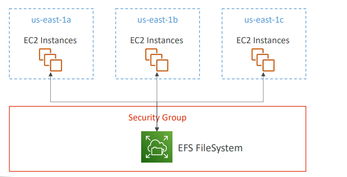
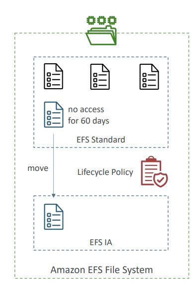

## Amazon EFS (Elastic File System)

- Managed NFS (network file system) that can be monunted on many EC2
- EFS work with EC2 instances in multi-AZ
- Highly available, scalable, expensive (3x gp2), pay per use

## Amazon EFS - Elastic File System

- Use cases: content management, web serving, data sharing, wordpress
- Uses NFSv4.l protocol
- Uses security group to control access to EFS
- Compatible with Linux based AMI (not windows)
- Encryption at rest using KMS

- POSIX file system (~Linux) that has a standard file API.
- File system scales automatically, pay-per-use, no capacity planning!

## EFS - Performance & Storage Classes

- EFS Scale
    - 1000s of concurrent NFS clients, 10 GB+ /s throughput
    - Grow to petabyte-scale network file system, automatically
- Performance Mode (set at EFS creation time)
    - General Purpose (default) - latency-sensitive use cases (web server, CMS, etc...)
    - Max I/O - higher latency, throughput, highly parallel (big data, media processing)
- Throughput Mode
    - Bursting - 1TB = 50MiB/s + burst of up to 100 MiB/s
    - Provisioned - set your throughput regardless of storage size, ex: 1 GiB/s for 1 TB storage
    - Elastic - automatically scales throughput up or down based on your workloads
        - Up to 3 GiB/s for reads and 1 GiB/s for writes
        - Used for unpredicatble workloads.

## EFS - Storage Classes

- Storage Tiers (lifecycle management feature - move file after N days)
    - standard: for frequently accessed files
    - Infrequent access (EFS-IA): cost to retrieve files, lower price to store.
    - Archieve: rarely accessed data (few times each year), 50% cheaper.
    - Implement lifecycle policies to move files between storage tiers.
- Availability and durability
    - Standard: Multi-AZ great for prod
    - One Zone: one AZ, great for dev, backup enabled by default, compatible with IA (EFS one zone- IA)

- Over 90% in cost savings.

## EBS vs EFS - Elastic Block Storage

- EBS volumes...
    - one instance (except multi-attach io1/io2)
    - are locked at the availability zone (AZ) level
    - gp2: IO increases if the disk size increases
    gp3 & io1: can increase independently
- To migrate an EBS volume across AZ
    - Take a snapshot
    - Restore the snapshot to another AZ
    - EBS backups use IO and you shouldn't run them while your application is handling a lot of traffic.
- Root EBS volumes of instances get terminated by default if the EC2 instance get terminated. (you can disable that)

### EBS vs EFS - Elastic File System

- Mounting 100s of instances across AZ
- EFS share website files (wordpress)
- Only for linux instances (POSIX)

- EFS has higher price point than EBS
- can leverage Storage Tiers for cost savings.
- Remember: EFs vs EBS vs Instance store.