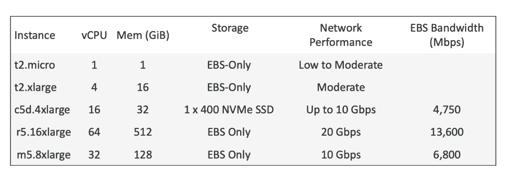

## EC2 Instance type

- You can use different types of EC2 instances that are optimised for different use cases
- AWS has the following naming convention: m5.2xlarge
    - m: instance class
    - 5: generation (AWS improves them over time)
    - 2xlarge: size within the instance class.

## EC2 Instance Types - General Purpose

- Great for a diversity of workloads such as web servers or code repositories.
- Balance between:
    - Compute
    - Memory
    - Networking
- t2.micro is a general purpose EC2 instance.

## EC2 Instance Types - Compute Optimized

- Great for compute-intensive tasks that require high performance processors:
    - Batch processing workloads
    - Media transcoding
    - High performance web servers.
    - High performance computing (HPC)
    - Scientific modeling & machine learning
    - Dedicated gaming servers.

## EC2 Instance Types - Memory Optimized

- Fast performance for workloads that process large data sets in memory
- Use cases:
    - High performance, relational/non-relational databases
    - Distributed web scale cache stores.
    - In-memory databases optimized for BI (Business intelligence)
    - Applications performing real-time processing of big unstructured data.

## EC2 Instance Types - Storage optimized

- Great for storing-intensive tasks that require high, sequential read and write
access to large data set on local storage.
- Use cases:
    - High frequency online transaction processing (OLTP) system.
    - Relational & NoSQL databases.
    - Cache for in-memory databases (for example, Redis)
    - Data warehousing applications
    - Distributed file systems.

## EC2 Instance Types: example

## EC2 Instances Purchasing Options

- On-Demand instances - short workload, predictable pricing, pay by second

- Reserved (1 & 3 years)
    - Reserved instances - long workloads
    - Convertible Reserved instances - long workloads with fexible instances

- Savind plans (1 & 3 years) - commitment to an amount of usage, long workloads

- Sport Instances - short workloads, cheap, can lose instances (less reliable)

- Dedicated Hosts - book an entire physical server, control instance hardware

- Dedicated Instances - no other customers will share your hardware

- Capacity Reservations - reserve capacity in a specific AZ for any duration.

## EC2 On Demand

- Pay for what you use:
    - Linux or Windows - billing per second, after the first minute
    - All other operating systems - billing per hour.
- Has the highest cost but no upfront payment.
- No long-term commitment
- Recommended for short-term and un-interrupted workloads, where you can't predict how the application will behave

## EC2 Reserved Instances

- Up to 72% discount compared to On-demand
- you reserve a specific instance attributes (Instance type, Region, Tenacy, OS)
- Reservation Period - 1 year (+discount) or 3 years (+++discount)
Payment Options - No Upfront(+), Partial Upfront(++), All upfront (+++)
- Reserved Instances's Scope - Regional or Zonal (reserve capacity in an AZ)
- Recommened for steady-state usage applications (Think database)
- You can buy and sell in the reserved Instance Marketplace
- Convertible Reserved Instance
    - Can change the EC2 instance type, instance famility, OS, scope and tenancy
    - Up to 66% discount.

## EC2 Savings Plans

- Get a discount based on long-term usage (up to 72% - same as RIs)
- Commit to a certain type of usage ($10/hour for 1 or 3 years)
- Usage beyond EC2 Savings Plans is billed at the On-Demand price.
- Locked to a specific instance familiy & AWS region (e.g. M5 in us-east-1)
- Flexible across:
    - Instance Size (e.g. m5.xlarge, m5.2xlarge)
    - OS (e.g. Linux, Windows)
    - Tenacy (Host, Dedicated, Default)

## EC2 Spot Instances

- Can get a discount of up to 90% compared to On-demand
- Instances that you can "lose" at any point of time if your max price is less than the current spot price.
- The MOST cost-efficient instances in AWS.

- Useful for workloads that are resilient to failure
    - Batch jobs
    - Data analysis
    - Image processing
    - Any distributed workloads
    - Workloads with a flexible start and end time

- Not suitable for critical jobs or databases.

## EC2 Dedicated Host

- A physical server with EC2 instance capacity full dedicated to your use
- Allows you address complicance requeriments and use your existing server-bound software licenses (per-socket, per-core, pe-VM software licenses)
- Purchasing Options:
    - On-demand - pay per second for active Dedicated Host
    - Reserved - 1 or 3 years (No Upfront, Partial Upfront, All Upfront)
    - The most expensive option
- Useful for software that have complicated licensing model (BYOL - Bring Your Own License)
- Or for companies that have strong regulatory or complicance needs.

## EC2 Dedicated Instances

- Instances run on hardware that's dedicated to you
- May share hardware with other instances in same account.
- No control over instance placement (can move hardware after stop/start)

## EC2 Capacity Reservations

- Reserve On-Demand instances capacity in a specific AZ for any duration
- You always have access to EC2 capacity when you need it.
- No time commitment (create/cancel anytime), no billing discounts
- Combine with Regional Reserved Instances and Savings plans to benefit from billing discounts
- You're charged at on-demand rate whether you run instances or not
- Suitable for short-term, uninterrupted workloads that needs to be in specific AZ

## Which purchasing option is right for me?

- On demand: coming and staying in resort whenever we like, we pay the full price.
- Reserved: like planning ahead and if we plan to stay for a long time, we may get a good discount.
- Savings Plans: pay a certain amount per hour for certain period and stay in any room type (e.g. King, Suite, Sea view,..)
- Spot instances: The hotel allows people to bid for the empty rooms and the highest bidder keeps the rooms. You can get kicked out at any time.
- Dedicated Hosts: We book an entire building of the resort
- Capacity Reservations: You book a room for a period with full price even you don't stay in it.

## AWS charges for IPv4 addresses

- Starting February 1 2024, there's a charge for all public IPv4 created in your account.

- $0.005 per hour of Public IPv4 (~ $3.6 per month)
- For new accounts in AWS, you have a free tier for the EC2 service: 750 hours of Public Ipv4 per month for the first 12 months.
- For all other services there's no free tier. 