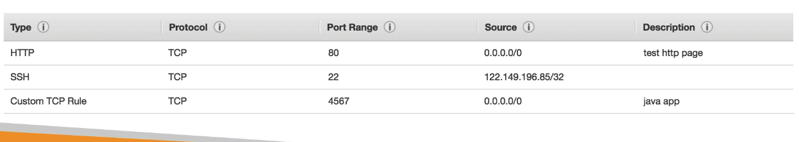
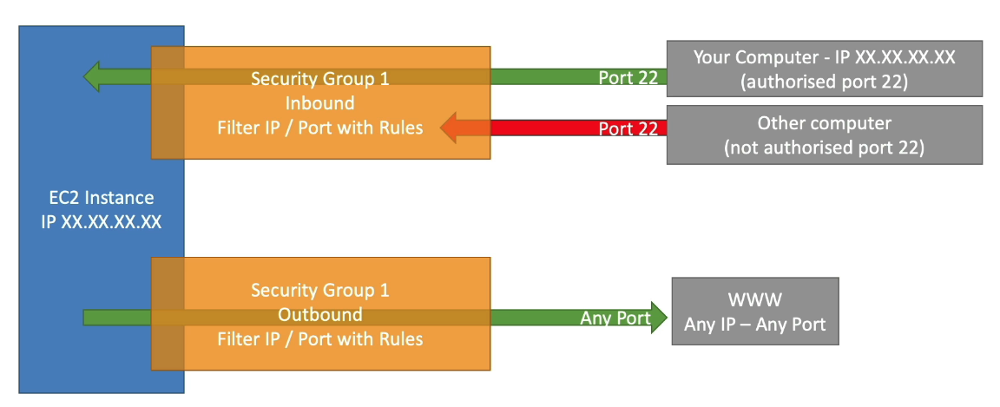

## Introduction to Security Groups

- Security Groups are the fundamental of network security in AWS
- They control how traffic is allowed into or out of our EC2 instances.

www    -> inbound traffic  ->       Security Group ====== |EC2 Instance|
       <- outbound traffic  <-
- Security groups only contains allow rules
- Security groups rules can reference by IP or by security group.

## Security Groups Deeper Dive

- Security groups are acting as a "firewall" on EC2 instances.
- They regulate:
    - Access to Ports
    - Authorised IP ranges - IPv4 and IPv6
    - Control of inbound network (from other to the instance)
    - Control of outbound network (from the instance to other)

## Security Groups Diagram

## Security Groups Good to know

- Can be attached to multiple instances
- Locked down to a region/VPC combination
- Does live "outside" the EC2 - if traffic is blocked the EC2 instance won't see it.
- It's good to maintain one separate security group for SSH access.
- If your application is not accessible (time out), then it's a security group issue.
- If your application gives a "connection refused" error, then it's an application error or it's not launched.
- All inbound traffic is blocked by default
- All outbound traffic is authorised by default.

## Classic ports to know

- 22 = SSH (Secure Shell) - log into a Linux instance
- 21 = FTP (File Transfer Protocol) - upload files into a file share
- 22 = SFTP (Secure File Transfer Protocol) - upload files using SSH
- 80 = HTTP - access unsecured website
- 443 = HTTPS - access secured websites. 
- 3389 - RDP (Remote Desktop Protocol) - log intoa windows instance.

chmod 0400 pemfile
ssh -i pemfile.pem ec2-user@ipaddress

