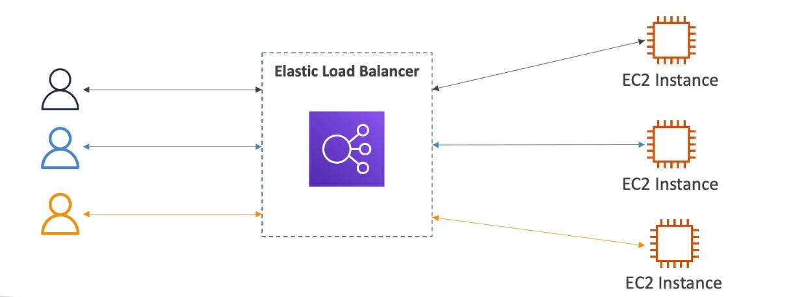
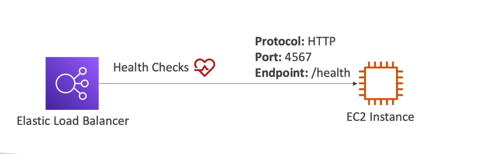
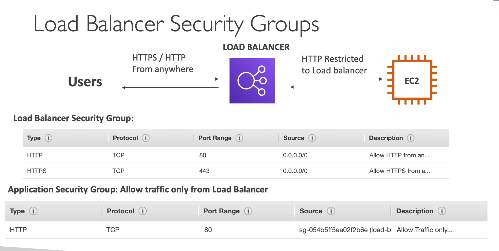

## What is load balancing?

- Load balances are servers that forward traffic to multiple servers (e.g. EC2 instances) downstream

## Why use a load balancer?

- Spread load across multiple downstream instances
- Expose a single point of access (DNS) to your application
- Seamlessly handle failure of downstream instances
- Do regular health checks to your instances
- Provide SSL termination (HTTPS) for your website.
- Enforce stickiness with cookies
- High availability across zones
- Separate public traffic from private traffic.

## Why use an Elastic Load Balancer?

- An Elastic Load Balancer is a managed load balancer
    - AWS guarantees that it will be working
    - AWS takes care of upgrades, maintenance, high availability
    - AWS provides only a few configuration knobs

- It costs less to setup your own load balancer but it will be a lot more effort on your end

- It is integrated with many AWS offerings/services
    - EC2, EC2 Auto Scaling Groups, Amazon ECS
    - AWS Certificate Manager (ACM), CloudWatch
    - Route 53, AWS WAF, AWS Global Accelerator.

## Health Checks

- Health Checks are crucial for Load Balancers
- They enable the load balancer to know if instances it fordwards traffic to are available to reply to requests.
- The health check is done on a port and route (/health is common)
- If the response is not 200 (OK), then the instance is unhealthy.

## Types of load balancer on AWS

- AWS has 4 kinds of managed Load Balancers
- Classic Load balancer (v1 - old generation) - 2009 - CLB
    - HTTP, HTTPS, TCP, SSL (secure TCP)
- Application Load Balancer (v2 - new generation) - 2016 - ALB
    - HTTP, HTTPS, WebSocket
- Network Load Balancer (V2 - new generation) - 2017 - NLB
    - TCP, TLS (secure TCP), UDP
- Gateway Load Balancer - 2020 - GWLB
    - Operates at layer 3 (Network layer) - IP Protocol

- Overall, It is recommened to use the newer generation load balancers as they provide more features
- Some load balancer can be setup as internal (private) or external (public) ELBs

