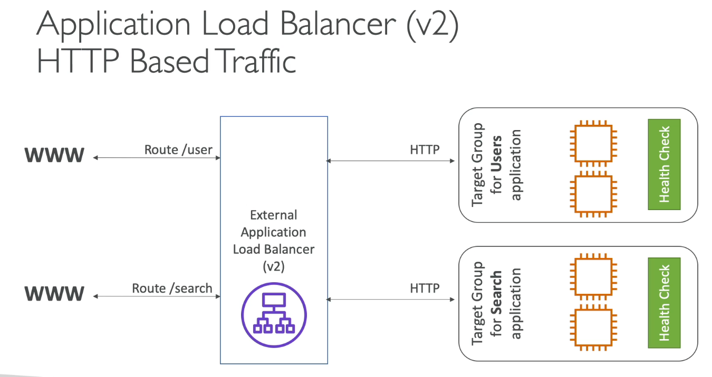
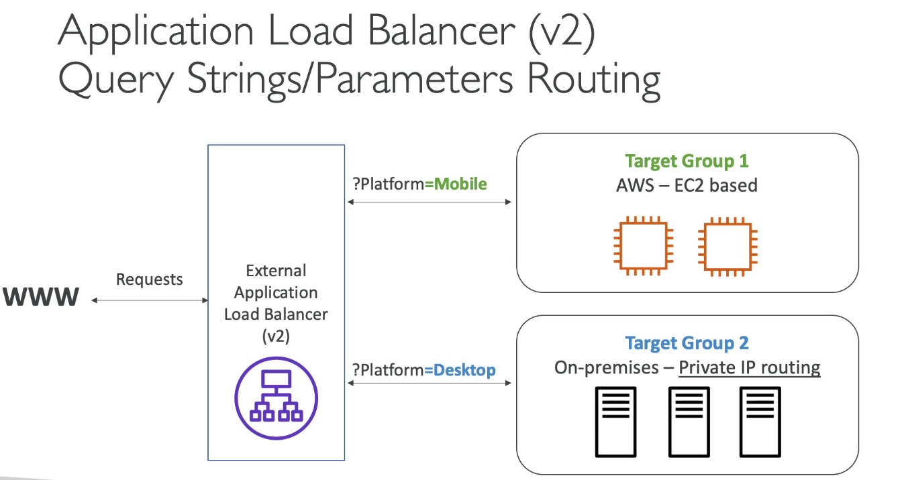

## What is load balancing?

- Load balances are servers that forward traffic to multiple servers (e.g. EC2 instances) downstream

## Why use a load balancer?

- Spread load across multiple downstream instances
- Expose a single point of access (DNS) to your application
- Seamlessly handle failure of downstream instances
- Do regular health checks to your instances
- Provide SSL termination (HTTPS) for your website.
- Enforce stickiness with cookies
- High availability across zones
- Separate public traffic from private traffic.

## Why use an Elastic Load Balancer?

- An Elastic Load Balancer is a managed load balancer
    - AWS guarantees that it will be working
    - AWS takes care of upgrades, maintenance, high availability
    - AWS provides only a few configuration knobs

- It costs less to setup your own load balancer but it will be a lot more effort on your end

- It is integrated with many AWS offerings/services
    - EC2, EC2 Auto Scaling Groups, Amazon ECS
    - AWS Certificate Manager (ACM), CloudWatch
    - Route 53, AWS WAF, AWS Global Accelerator.

## Health Checks

- Health Checks are crucial for Load Balancers
- They enable the load balancer to know if instances it fordwards traffic to are available to reply to requests.
- The health check is done on a port and route (/health is common)
- If the response is not 200 (OK), then the instance is unhealthy.

## Types of load balancer on AWS

- AWS has 4 kinds of managed Load Balancers
- Classic Load balancer (v1 - old generation) - 2009 - CLB
    - HTTP, HTTPS, TCP, SSL (secure TCP)
- Application Load Balancer (v2 - new generation) - 2016 - ALB
    - HTTP, HTTPS, WebSocket
- Network Load Balancer (V2 - new generation) - 2017 - NLB
    - TCP, TLS (secure TCP), UDP
- Gateway Load Balancer - 2020 - GWLB
    - Operates at layer 3 (Network layer) - IP Protocol

- Overall, It is recommened to use the newer generation load balancers as they provide more features
- Some load balancer can be setup as internal (private) or external (public) ELBs

## Application Load Balancer (V2)

- Application load balancers is layer 7 (HTTP)
- Load Balancing to multiple HTTP applications across machines (target groups)
- Load balancing to multiple applications on the same machine (ex: containers)
- Support for HTTP/2 and WebSocket
- Support redirects (from HTTP to HTTPS for example)

## Application Load Balancer (V2)

- Routing tables to a different target groups:
    - Routing based on path in URL (example.com/users & example.com/posts)
    - Routing based on hostname in URL (one.example.com & other.example.com)
    - Routing based on Query String, Headers (example.com/users?id=123&order=false)

- ALB are great fit for micro services & container-based application (example: Docker & Amazon ECS)
- Has a port mapping feature to redirect to a dynamic port in ECS
- In comparison, we'd need multiple  Clasic Load Balancer per application.

## Application Load Balancer (V2) Target Groups

- EC2 instances (can be managed by an Auto Scaling Group) - HTTP
- ECS tasks (managed by ECS itself) - HTTP
- Lambda functions - HTTP request is translated into a JSON event
- IP Addresses - must be private IPs

- ALB can route to multiple target groups
- Health checks are at the target group level

## Application Load Balancer (V2) Good to Know

- Fixed hostname (XXX.region.elb.amazonaws.com)
- The application servers don't see the IP of the client directly
    - The true IP of the client is inserted in the header X-Forwarded-For
    - We can also get Port (X-Forwarded-Port) and proto (X-Forwarded-Proto)

