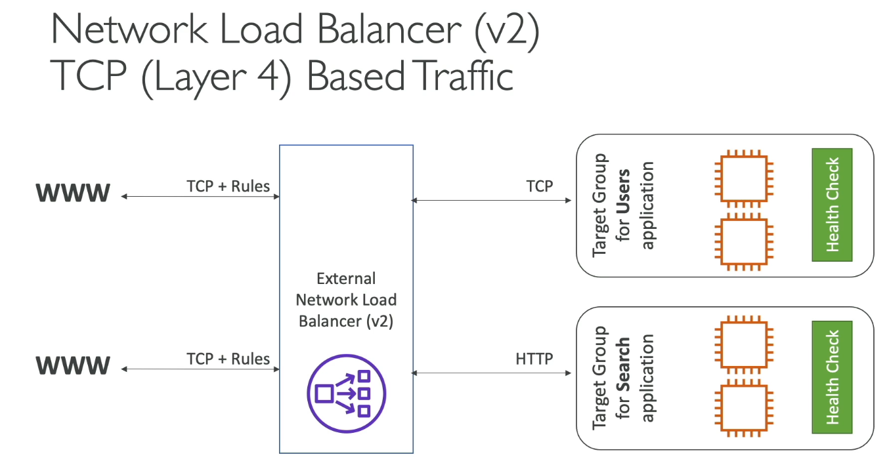
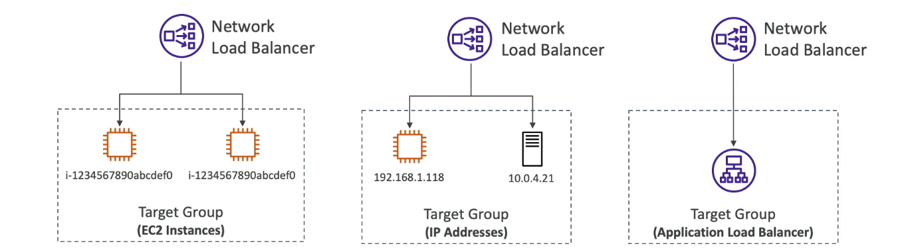

## Network Load Balancer (V2)

- Netqork load balancers (Layer 4) allow to:
    - Forward TCP & UDP traffic to your instances
    - Handle millions of request per seconds
    - Ultra-low latency

- NLB has one static IP per AZ, and supports assigning Elastic IP (helpful for whitelistings specific IP)
- NLB are used for extreme performance, TCP or UDP traffic
- Not included in the AWS free tier

## Network Load Balancer - Target Groups

- EC2 instances
- IP Addresses - must be private Ips
- Application Load Balancer
- Health Checks support the TCP, HTTP, and HTTPS Protocols

