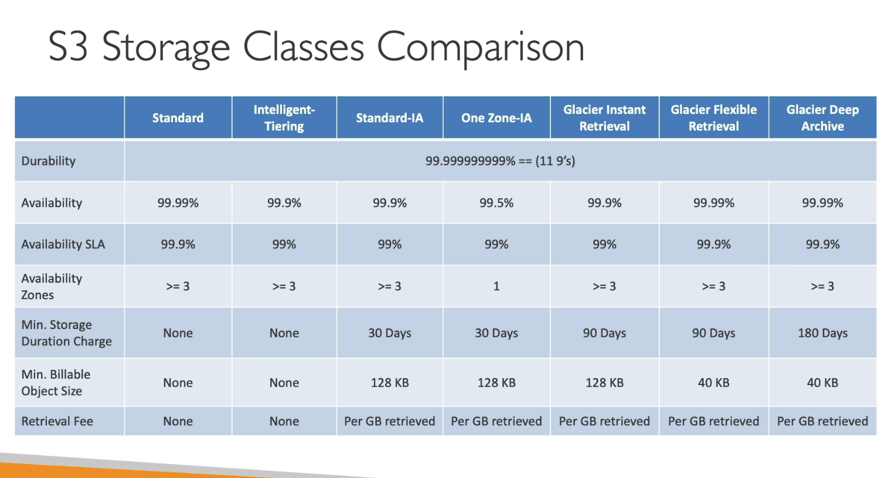

# Amazon S3 Introduction

## Section Introduction

- Amazon S3 is one of the main building blocks of AWS.
- It’s advertised as “infinitely scaling” storage.
- Many websites use Amazon S3 as a backbone.
- Many AWS services integrate with Amazon S3.

---

## Amazon S3 Use Cases

- Backup and storage
- Disaster recovery
- Archiving
- Hybrid cloud storage
- Application hosting
- Media hosting
- Data lakes & big data analytics
- Software delivery
- Static website hosting

---

## Amazon S3 - Buckets

- Amazon S3 allows users to store objects (files) in “buckets” (directories).
- Buckets must have a **globally unique name** (across all regions and accounts).
- Buckets are defined at the **region level**.
- S3 appears as a global service, but buckets are created in a specific region.

### Bucket Naming Conventions

- No uppercase letters or underscores
- Length must be between 3–63 characters
- Cannot be formatted as an IP address
- Must start with a lowercase letter or number
- Must **not** start with the prefix `xn--`
- Must **not** end with the suffix `-s3alias`

---

## Amazon S3 - Objects

- Objects (files) have a **Key**.
- The key is the full path to the object:
  - `s3://my-bucket/my_file.txt`
  - `s3://my-bucket/my_folder/another_folder/my_file.txt`
- The key is composed of:  
  `prefix + object name`
- There's no true concept of "directories" — the S3 UI only makes it appear that way.
- Objects are simply stored with long keys that contain `/` characters.

---

### Amazon S3 - Objects (continued)

- **Object values** are the content (body) of the file.
  - Max object size: **5TB**
  - For objects > 5GB, use **multi-part upload**
- **Metadata**: System/user-defined key-value text pairs
- **Tags**: Unicode key-value pairs (up to 10)
  - Useful for **security** and **lifecycle management**
- **Version ID**: If versioning is enabled, each object version has an ID

---

## S3 Pre-Signed URL

- By default, all S3 objects are **private**.
- Only the **object owner** has access by default.
- The object owner can create a **pre-signed URL** to grant **temporary, secure access** to others.
- Pre-signed URLs use **AWS credentials** to authorize access and can be used in browsers or applications.

---

## Amazon S3 - Security

### User-Based Security

- **IAM Policies**: Define which S3 API calls a specific IAM user is allowed to perform.

### Resource-Based Security

- **Bucket Policies**: Set rules at the bucket level (can allow cross-account access).
- **Object ACLs**: Finer-grained access control (can be disabled).
- **Bucket ACLs**: Less commonly used (can also be disabled).

### Access Conditions

An IAM principal can access an S3 object if:

- The **IAM policy allows** it OR the **resource policy allows** it  
  **AND**
- There is **no explicit DENY**

### Encryption

- Objects can be encrypted using **encryption keys** for added security.

---

## S3 Bucket Policy

- Written in **JSON**
- Policy components:
  - **Resources**: Buckets or objects
  - **Effect**: `Allow` or `Deny`
  - **Actions**: S3 API operations
  - **Principal**: Account or user to apply the policy to

### Example: Public Read Access

```json
{
  "Version": "2012-10-17",
  "Statement": [
    {
      "Sid": "PublicReadGetObject",
      "Effect": "Allow",
      "Principal": "*",
      "Action": "s3:GetObject",
      "Resource": "${aws_s3_bucket.static_website.arn}/*"
    }
  ]
}
```

## Bucket Settings for Block Public Access

- These settings were created to **prevent company data leaks**.
- Even if an S3 Bucket Policy allows public access, if these settings are **enabled**, the bucket will **not** be public.
- If you're certain the bucket should **never** be public, it's best to **keep these settings enabled**.
- These settings can be configured at the **account level** as well as the **bucket level**.


## Amazon S3 - Versioning

- You can version your files in Amazon S3
- It is enabled at the bucket level
- Same key overwrite will change the "version": 1,2,3...
- It is best practice to version your buckets
  - Protect against unintended deletes (ability to restore a version)
  - Easy roll back to previous version
- Notes:
  - Any file that is not versioned prior to enabling versioning will have version "null".
  - Suspending versioning does not delete the previuos version.

  ## Amazon S3 - Replication (CRR & SRR)

  - Must enable versioning in source and destination buckets
  - Cross-Region Replication (CRR)
  - Same-Region Replication (SRR)
  - Buckets can be in different AWS accounts
  - Copying is asynchronous
  - Must give proper IAM permissions to S3

  - Use cases:
    - CRR - compliance, lower latency access, replication across accounts.
    - SRR - log aggregation, live replication between production and test accounts.

## Amazon S3 - Replication (Notes)

- After you enable replication, only new objects are replicated
- Optionally, you can replicate existing objects using S3 Batch Replication.
  - Replicates existing objects and objects that failed replication.
- For DELETE operations
  - Can replicate delete markes from source to target (optional setting)
  - Deletions with a verion ID are not replicated (To avoid malicious deletes)
- There is no "chaining" of replication
  - If bucket 1 has replication into bucket 2, which has replication into bucket 3


## S3 Storage Classes

- Amazon S3 Standard - General Purpose
- Amazon S3 Standard-Infrequent Access (IA)
- Amazon S3 One Zone-Infrequent Access
- Amazon S3 Glacier Instant Retrieval
- Amazon S3 Glacier Flexible Retrieval
- amazon S3 Glacier Deep Archive
- Amazon S3 Intelligent Tiering

- Can move between classes manually or using S3 lifecycle configuration

## S3 Durability and Availability

Durability represents how many times an object is going to be lost by Amazon S3

- Durability:
  - High availability (99.999999999% || 9's) of objects across multiple AZ
  - If you store 10,000,000 objects with Amazon S3, you can on average expect to incur a loss of a single object once every 10,000 years
  - same for all storage classes.

- Availability:
  - Measures how readily available a service is
  - Varies depending on storage class
  - Example: S3 Standard has 99.99% availability = not available 53 minutes a year.


## S3 Standard - General Purpose

- 99.99% Availabilty
- Used for frequently accessed data
- Low latency and high throughput
- Sustain 2 concurrent facility failures 
- Use cases: Big Data Analytics, mobile & gaming applications, content distribution

## Storage Classes - Infrequent Access

- For data that is less frequently accessed, but requires rapid access when needed.
- lower cost than Standard

- Amazon S3 Standard-Infrequent Access (S3 standard-IA)
  - 99.9% Availability
  - Use cases: Disaster Recovery, backups

- Amazon S3 One Zone-Infrequent Access (S3 One to Zone-IA)
  - High durability (99.9999999%) in a single AZ; data lost when AZ is destroyed
  - 99.5% Availabilily
  - Use cases: Storing secondary backup copies of on-premise data, or data you re-create


## Amazon S3 Glacier Storage Classes

- Low-cost object storage meant for archiiving / backup
- Pricing: price for storage + object retrieval cost

- Amazon. S3 Glacier Instant Retrieval
  - Millisecond retrieval, great for data ccessed once a quarter
  - Minimum storage duration of 90 days

- Amazon S3 Glacier Flexible Retrieval (Formerly Amazon S3 Glacier):
  - Expedited (1 to 5 minutes), Standard (3 to 5 hours), Bulk (5 to 12 hours) - free
  Minimun storage duration of 90 days

- Amazon S3 Glacier Deep Archive - for long term storage
  - Standard (12 hours), Bulk (48 hours)
  - Minimum storage duration of 180 days

## S3 Intelligent-Tiering

- Small monthly monitoring and auto-tiering fee
- Moves objects automatically between Access Tiers based on usage
- There are no retrieval charges in S3 Intelligent-Tiering

- Frequent Access tier (automatic): default tier
- Infrequent Access tier (automatic): Objects not accessed for 30 days
- Archieve Instant Access tier (automatic): objects not accessed for 90 days
- Archieve Access tier (optional): configurable from 90 days to 700 days
- Deep Archieve Access tier (optional): config from 180 days to 700 days

## S3 Storage Classes Comparison

