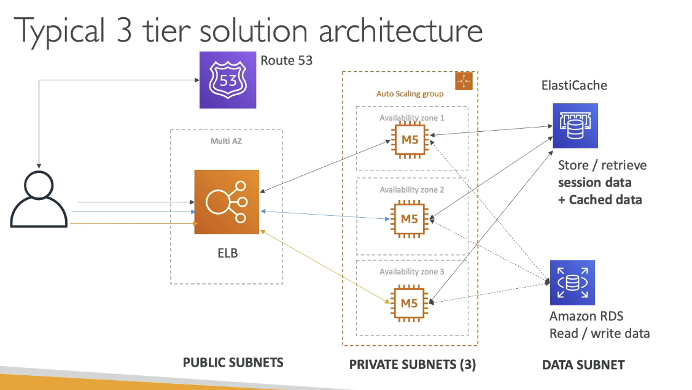

# VPC (Virtual Private Cloud) - AWS

## What is it?

> A Virtual Private Cloud (VPC) is a private, isolated network in AWS where you can deploy and manage your resources securely. It’s a **regional** resource.

## Key Concepts

* **VPC**: Private network to deploy your resources (regional resource).
* **Subnets**: Partition your VPC network into smaller networks tied to specific Availability Zones.
* **Public Subnet**: Accessible from the internet.
* **Private Subnet**: Not directly accessible from the internet.
* **Route Tables**: Define access to the internet and between subnets.

## Components

* **Internet Gateway (IGW)**: Enables VPC instances to connect to the internet. Public subnets have a route to it.
* **NAT Gateways / NAT Instances**: Allow private subnet instances to access the internet without being publicly accessible.
* **Network ACL (NACL)**: Subnet-level firewall, supports allow & deny rules, rules are stateless and only include IPs.
* **VPC Flow Logs**: Capture IP traffic info for interfaces (VPC, subnets, ENIs) for monitoring and troubleshooting.
* **VPC Endpoints**: Private connection to AWS services without using the public internet.
* **VPC Peering**: Private connection between two VPCs using AWS’ network.
* **Site-to-Site VPN**: Encrypted VPN connection between on-premises and AWS over the public internet.
* **Direct Connect (DX)**: Private, secure, physical connection between on-premises and AWS.

## Use Cases

* Isolating resources inside a secure private network.
* Giving private resources controlled internet access (via NAT).
* Connecting multiple VPCs securely (VPC Peering).
* Establishing secure on-premises to AWS connections (VPN or Direct Connect).
* Monitoring and troubleshooting network traffic with Flow Logs.

## How it works (basic flow)
....

## Security Notes

* **NACL**: Stateless, subnet-level, supports both allow & deny rules.
* **Security Groups**: Stateful, instance/ENI level.
* **VPC Endpoints**: Reduce public exposure by keeping traffic within AWS network.
* **VPN Encryption**: Site-to-Site VPN is encrypted; Direct Connect is private but may require extra encryption depending on compliance needs.

## Question to Ask Yourself

* What networking problem am I solving with this VPC setup?
* Do I need public internet access, private-only, or hybrid?
* Can I explain the difference between NACL and Security Groups?
* Do my VPC CIDRs overlap with other VPCs or on-premises networks?
* Am I sending traffic over the internet unnecessarily instead of using VPC Endpoints?

## Notes & Gotchas

* VPC Peering is **not transitive**; each pair of VPCs must be directly connected.
* CIDR blocks must not overlap for Peering.
* NAT Gateways are AWS-managed but cost per hour + data processed; NAT Instances are cheaper but self-managed.
* Flow Logs can send data to S3, CloudWatch Logs, or Kinesis Data Firehose.
* Public subnets require a route to an IGW; private subnets use NAT for outbound internet.
* Direct Connect setup can take at least a month.

## Extra (optional)

* **CLI Command** to create a VPC:

  ```bash
  aws ec2 create-vpc --cidr-block 10.0.0.0/16
  ```
* **Pricing Tips**:

  * VPC itself is free, but NAT Gateways, Direct Connect, and data transfer incur charges.
  * VPC Endpoints for S3 and DynamoDB are generally cheaper (Gateway type) than Interface type.
* **Hands-on Reminder**: Always test connectivity between subnets and resources after setup using ping, curl, or traceroute.
* **Terraform Implementation**:

  * Use `aws_vpc`, `aws_subnet`, `aws_internet_gateway`, `aws_nat_gateway`, `aws_route_table`, and `aws_vpc_endpoint` resources.


